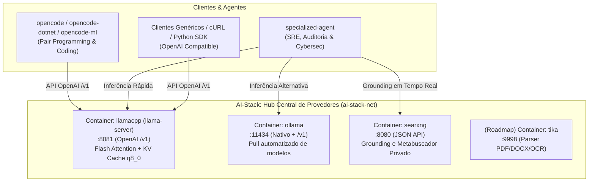

# AI-Stack: Hub Central de Provedores de IA e Inferência Neural

O **AI-Stack** é a camada de infraestrutura compartilhada do projeto, responsável por fornecer **motores de inferência neural acelerados por GPU NVIDIA** e **serviços de suporte (busca privada e ingestão)** para todos os agentes do ecossistema ([`opencode/`](../opencode/), [`opencode-dotnet/`](../opencode-dotnet/), [`opencode-ml/`](../opencode-ml/) e [`specialized-agent/`](../specialized-agent/)).

---

## 1. Arquitetura e Papel no Ecossistema

Em vez de cada agente gerenciar sua própria instância de modelo (o que geraria disputa destrutiva de VRAM na GPU local), o **AI-Stack centraliza os serviços neurais**, permitindo que múltiplos clientes consumam APIs padronizadas:



---

## 2. Pré-requisitos de Hardware e Software

### 2.1. Hardware
- **GPU NVIDIA:** Arquitetura Turing, Ampere, Ada Lovelace, Blackwell ou superior (série GTX 16xx, RTX 20xx, 30xx, 40xx, A-series);
- **VRAM Recomendada:**
  - **Mínimo (6 GB VRAM):** Modelos 7B quantizados em `Q4_K_M` com KV Cache quantizado em `q8_0` (janela de 8.192 tokens consome ~5.2 GB);
  - **Recomendado (8 GB a 12 GB VRAM):** Modelos 7B em `Q5_K_M`/`Q8_0` ou 14B em `Q4_K_M` com folga de contexto até 16.384 tokens;
  - **Avançado (16 GB+ VRAM):** Modelos 14B a 32B ou execução simultânea com modelos de reranking;
- **Memória RAM:** Mínimo de 16 GB no host;
- **Armazenamento:** 10 GB a 25 GB livres para imagens de container e arquivos de modelos GGUF.

### 2.2. Software no Host Linux
1. **Drivers NVIDIA:** Drivers proprietários instalados e operacionais:
   ```bash
   nvidia-smi
   ```
2. **Container Engine (Podman ou Docker):**
   - **Podman:** Versão 4.4 ou superior com suporte a CDI (`nvidia.com/gpu=all`) configurado via `nvidia-container-toolkit`:
     ```bash
     sudo nvidia-ctk cdi generate --output=/etc/cdi/nvidia.yaml
     ```
   - **Docker:** Docker Engine + `nvidia-container-toolkit` (`--gpus all`).

---

## 3. Estrutura do Diretório

```text
ai-stack/
├── docker-compose.yml     # Orquestração multi-serviço (perfis: llamacpp, ollama, searxng)
├── start-stack.sh         # Script unificado de inicialização e controle de rede
├── stop-stack.sh          # Finalizador rápido de todos os containers da stack
├── download-model.sh      # Downloader de modelos GGUF do Hugging Face
├── opencode.json          # Configuração pronta para o OpenCode consumir a stack
├── ai-stack               # Fonte de sincronização da configuração do OpenCode
├── README.md              # Este guia completo de arquitetura e operação
│
├── models/                # Volume local persistente de modelos .gguf
│   └── .gitignore         # Ignora binários pesados no controle de versão
│
└── searxng/               # Configurações do metabuscador
    └── settings.yml       # Ativação da API JSON e motores otimizados
```

---

## 4. Guia Rápido de Operação

### 4.1. Download do Modelo GGUF (para llama.cpp)
O script `download-model.sh` já possui atalhos para os melhores modelos de desenvolvimento e raciocínio:

```bash
cd ai-stack

# Baixar o Qwen 2.5 Coder 7B (Excelente para código e OpenCode):
./download-model.sh qwen2.5-coder:7b

# Ou baixar o DeepSeek-R1 7B (Excelente para raciocínio procedural e auditoria):
./download-model.sh deepseek-r1:7b

# Ou baixar modelo de 14B (se possuir 12GB+ de VRAM):
./download-model.sh qwen2.5-coder:14b
```

### 4.2. Iniciar a Stack de Serviços

#### Modo Padrão: llama.cpp + SearXNG (Recomendado para Máxima Performance)
Inicia o `llama-server` acelerado por GPU com Flash Attention e KV Cache quantizado, expondo a porta `8081` em `127.0.0.1` de forma segura:

```bash
./start-stack.sh llamacpp
```

#### Modo Ollama: Ollama + SearXNG
Inicia o motor oficial do Ollama com gestão de downloads via `ollama pull`:

```bash
./start-stack.sh ollama
```

#### Modo Completo (All)
Inicia tanto o llama.cpp quanto o Ollama e o SearXNG:

```bash
./start-stack.sh all
```

#### Modos de Exposição de Rede
- **Local Seguro (Padrão):** Publica as portas apenas no loopback local (`127.0.0.1:8081`, `127.0.0.1:11434`, `127.0.0.1:8080`), permitindo que containers de clientes como o OpenCode acessem via `http://host.containers.internal:8081/v1`.
- **Zero Host Exposure (`--isolate`):** Não expõe nenhuma porta no host, restringindo a comunicação exclusivamente à rede bridge interna `ai-stack-net`:
  ```bash
  ./start-stack.sh llamacpp --isolate
  ```

### 4.3. Encerrar os Serviços
Para parar e limpar os containers da stack:

```bash
./stop-stack.sh
```

---

## 5. Integração com os Agentes

### 5.1. OpenCode (`opencode`, `opencode-dotnet`, `opencode-ml`)
O arquivo [`opencode.json`](opencode.json) já vem configurado para consumo imediato:

```json
{
  "model": "local/qwen2.5-coder:7b",
  "provider": {
    "local": {
      "npm": "@ai-sdk/openai-compatible",
      "name": "Local AI-Stack",
      "options": {
        "baseURL": "http://host.containers.internal:8081/v1",
        "apiKey": "local"
      },
      "models": {
        "qwen2.5-coder:7b": {
          "name": "qwen2.5-coder:7b",
          "limit": { "context": 8192, "output": 4096 }
        }
      }
    }
  }
}
```

Para usar no seu projeto:
1. Copie o `opencode.json` para a raiz do seu projeto ou execute o `opencode` na pasta atual;
2. Inicie a stack com `./start-stack.sh llamacpp`;
3. Execute o agente:
   ```bash
   opencode
   # ou
   opencode-dotnet
   ```

### 5.2. Specialized Agent (`specialized-agent`)
O [`specialized-agent`](../specialized-agent/) conecta-se automaticamente à infraestrutura compartilhada:

```bash
# Na raiz do repositório:
cd specialized-agent
./run-agent.sh --backend llamacpp -w exemplo-audit --web-search
```

### 5.3. Teste Manual com cURL
Você pode testar a inferência diretamente pelo terminal do host:

```bash
curl http://127.0.0.1:8081/v1/chat/completions \
  -H "Content-Type: application/json" \
  -d '{
    "messages": [{"role": "user", "content": "Escreva uma função Fibonacci em C#"}],
    "temperature": 0.2
  }'
```

---

## 6. Comparativo e Benchmark Completo

Para uma análise detalhada de desempenho na GPU NVIDIA GeForce RTX 4050 Mobile (6GB VRAM), incluindo curvas de degradação com janelas de 8k, 16k e 32k, orçamentos físicos de VRAM e perfil de alucinações dos modelos (Qwen vs. DeepSeek), consulte o documento completo:

👉 **[Relatório de Benchmark de Engenharia (RTX 4050 6GB)](benchmark.md)**

---

## 7. Script de Limpeza Completa (`clean.sh`)

Para realizar uma faxina completa no sistema, parando containers, excluindo imagens do agente, limpando volumes e apagando modelos baixados em disco:

```bash
# Execução interativa (pede confirmação):
./ai-stack/clean.sh
# ou da raiz:
./clean.sh

# Execução não-interativa (forçada):
./ai-stack/clean.sh -y

# Limpeza incluindo imagens base dos provedores:
./ai-stack/clean.sh -y --all-images
```

---

## 8. Roadmap de Infraestrutura

- [x] Unificação e centralização da infraestrutura de inferência local;
- [x] Suporte dual a Ollama e llama.cpp com aceleração GPU e Modo Router;
- [x] Grounding de busca privativa com SearXNG (JSON API) ativa por padrão;
- [x] Benchmark empírico consolidado de modelos 7B e escalas de contexto (8k a 32k);
- [x] Script de limpeza total de containers, redes, volumes e modelos (`clean.sh`);
- [ ] **Apache Tika Container (`apache/tika:latest-full`):** Ingestão de relatórios PDF, DOCX e OCR de capturas de tela sem expor portas no host;
- [ ] **Vector & RAG Services:** Módulo leve de busca lexical/híbrida (SQLite FTS5 / BM25) e Reranker em CPU (FlashRank).
