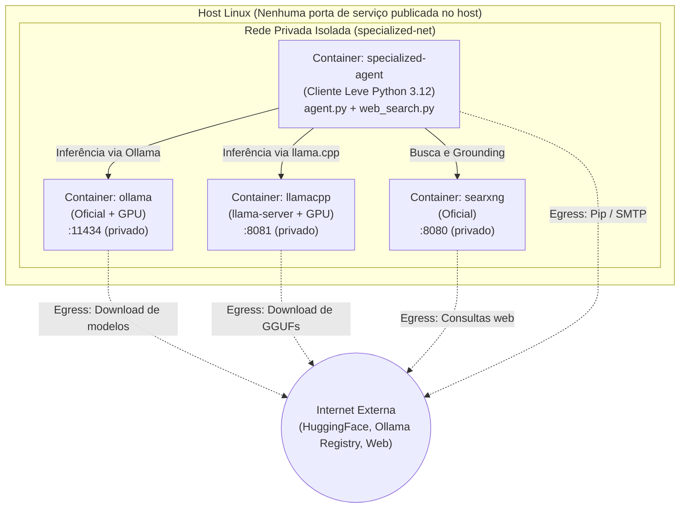
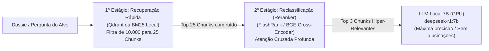

# Specialized Agent: Orquestrador Modular de Agentes e Skills

Container de **agente de IA autônomo e modular** voltado para perícias técnicas, **SRE**, **Cibersegurança**, **Análise Forense de Logs** e **Auditoria de Conformidade**, acelerado por **GPU NVIDIA** local (CUDA/CDI) e suportando múltiplos motores neurais (**Ollama** e **llama.cpp**) integrados a metabusca privada (**SearXNG**).

A infraestrutura neural pode ser provisionada localmente pelo próprio agente ou consumida a partir do hub central de infraestrutura do repositório ([`ai-stack/`](../ai-stack/)).

O projeto adota uma **arquitetura desacoplada, segura e extensível**:
- **Skill Principal** (`SKILL.md`) e **Orquestrador Central** (`agent.py`) coordenam a descoberta de trabalhos, ciclo de vida, telemetria e inferência neural;
- **Isolamento Estrito de Rede:** Os serviços de suporte (Ollama, llama.cpp, SearXNG) comunicam-se exclusivamente através de uma **rede privada interna**, sem expor nenhuma porta no host, preservando saída (*egress*) para a internet;
- **Integração com AI-Stack:** Compatível diretamente com o [`ai-stack/`](../ai-stack/), permitindo que uma única instância de GPU atenda simultaneamente tanto a auditorias especializadas quanto aos agentes interativos (`opencode`);
- **Suporte Dual a Motores Neurais:** Escolha entre **Ollama** (gestão simplificada com pull automatizado) e **llama.cpp** (máxima performance, Flash Attention nativo e quantização de KV Cache para modelos 7B);
- **Grounding em Tempo Real com SearXNG:** Enriquecimento factual com busca web higienizada e compactada, eliminando alucinações e contaminação de contexto (*context stuffing*);
- **Especializações Modulares:** Novas áreas de atuação são adicionadas criando subpastas de trabalho com suas próprias diretrizes (`SKILL.md`), bases de conhecimento (`knowledge/`), utilitários (`scripts/`, `bin/`) e coletores de dados (`runner.py`).

---

## 1. Arquitetura do Projeto

```text
specialized-agent/
├── SKILL.md                   # Skill Principal (Meta-Skill e governança central)
├── agent.py                   # Orquestrador central: descobre subpastas e executa inferência
├── web_search.py              # Módulo de busca SearXNG, higienização e grounding para 7B
├── Dockerfile                 # Imagem monolítica com Ollama e Python embutidos
├── Dockerfile.agent           # Imagem desacoplada leve (Python 3.12, ~150MB)
├── entrypoint.sh              # Gestão de ciclo de vida para o container monolítico
├── entrypoint-agent.sh        # Gestão de ciclo de vida para o agente desacoplado
├── build.sh                   # Compilação da imagem monolítica
├── build-agent.sh             # Compilação da imagem desacoplada leve
├── run.sh                     # Execução flexível com autodetecção de rede
├── run-agent.sh               # Execução conectada à stack desacoplada
├── start-stack.sh             # Inicializador de serviços isolados (Ollama/llama.cpp + SearXNG)
├── stop-stack.sh              # Finalizador de containers da stack
├── docker-compose.yml         # Orquestração multi-serviço (profiles: default, llamacpp)
├── README.md                  # Este guia completo de arquitetura e operação
│
├── llamacpp/                  # Suporte nativo ao llama.cpp (llama-server)
│   ├── download-model.sh      # Downloader de modelos GGUF do Hugging Face
│   ├── start-llamacpp.sh      # Inicializador do llama-server com GPU em rede privada
│   └── stop-llamacpp.sh       # Encerramento do container llamacpp
│
├── models/                    # Volume local compartilhado para arquivos .gguf
│
├── searxng/                   # Suporte ao Metabuscador Privado SearXNG
│   ├── settings.yml           # Configuração de motores e ativação da API JSON
│   ├── run-searxng.sh         # Inicializador independente do container SearXNG
│   └── docker-compose.yml     # Compose dedicado para o serviço de busca
│
├── exemplo-audit/             # Especialização de referência e template pronto
│   ├── SKILL.md               # Diretrizes de auditoria e conformidade técnica
│   ├── knowledge/             # Bases de conhecimento locais (*.md)
│   ├── runner.py              # Coletor de evidências, conectividade e prompt builder
│   ├── requirements.txt       # (Opcional) Dependências Python locais
│   └── .env.example           # Exemplo de variáveis e credenciais SMTP/SearXNG
│
└── <pasta-de-trabalho>/       # Novas especializações criadas por você
    ├── SKILL.md (ou skills/)  # Diretrizes técnicas da especialização
    ├── knowledge/             # Documentações e bases de conhecimento (*.md)
    ├── .env                   # (Opcional) Credenciais e parâmetros de ambiente
    ├── requirements.txt       # (Opcional) Dependências Python da especialização
    ├── runner.py              # (Opcional) Coletor de fatos e dossiês
    ├── scripts/               # (Opcional) Ferramentas e scripts auxiliares
    └── bin/                   # (Opcional) Binários e atalhos executáveis
```

---

## 2. Topologia de Rede e Isolamento Estrito

O projeto implementa uma política de segurança em que **nenhum serviço neural ou de busca expõe portas na máquina host**, eliminando riscos de colisão de portas (11434, 8080, 8081) e acessos externos não autorizados, mantendo acesso de saída (*egress*) para a internet:



---

## 3. Motores de Inferência: Ollama vs. llama.cpp

O orquestrador suporta alternância transparente entre backends via parâmetro `--backend [ollama|llamacpp]`:

| Característica | Backend Ollama | Backend llama.cpp (`llama-server`) |
| :--- | :--- | :--- |
| **Público-Alvo** | Máxima praticidade e facilidade de operação | Máxima performance, menor uso de VRAM e controle de hardware |
| **Download de Modelos** | Automático via registro (`ollama pull`) | Download direto de `.gguf` do Hugging Face (`download-model.sh`) |
| **Flash Attention** | Habilitado via Ollama runner | Nativo direto nos kernels CUDA (`-fa`) |
| **Quantização de KV Cache** | FP16 padrão | Quantizado para 8 bits (`-ctk q8_0 -ctv q8_0`) economizando 50% de VRAM |
| **Janela de Contexto em 7B** | 8.192 tokens consome ~7.5GB VRAM | 8.192 tokens consome ~5.5GB a 6GB VRAM |
| **API de Comunicação** | Nativa `/api/generate` | OpenAI-compatible `/v1/chat/completions` |

---

## 4. Grounding e Busca Web com SearXNG (Otimizado para 7B)

Modelos de 7B (como `deepseek-r1:7b` e `qwen2.5-coder:7b`) têm alta capacidade de raciocínio procedural, mas sofrem de limite de conhecimento congelado (*cutoff*) e são suscetíveis a alucinações se alimentados com páginas web brutas (*context stuffing*).

O módulo [`web_search.py`](web_search.py) atua como um intermediário inteligente:
1. **Consulta Privada:** Envia a busca para a instância local do SearXNG via API JSON (`format=json`);
2. **Higienização Estrita:** Remove tags HTML, scripts, caracteres de escape e desduplica URLs;
3. **Controle de Densidade de Informação:** Limita os trechos a **350 caracteres por fonte** e seleciona apenas os **top 3 resultados mais relevantes** (~250–350 tokens no total);
4. **Formatação Estruturada:** Injeta o contexto no prompt com identificadores de fonte, URL e diretrizes rigorosas para que o modelo cite as fontes e não invente dados além das evidências apresentadas.

---

## 5. Guia Rápido de Execução

### 5.1. Modo Recomendado: Stack Desacoplada (Isolada)

#### Cenário 1: Com Backend Ollama (Padrão)
```bash
# 1. Iniciar os serviços isolados (Ollama com GPU + SearXNG):
./start-stack.sh ollama

# 2. Executar a auditoria com busca web ativa:
./run-agent.sh -w exemplo-audit --web-search
```

#### Cenário 2: Com Backend llama.cpp (Alta Performance)
```bash
# 1. Baixar o modelo GGUF desejado (ex.: DeepSeek-R1 7B Q4_K_M):
./llamacpp/download-model.sh deepseek-r1:7b

# 2. Iniciar os serviços isolados (llama.cpp com GPU + SearXNG):
./start-stack.sh llamacpp

# 3. Executar a auditoria apontando para o llama.cpp:
./run-agent.sh --backend llamacpp -w exemplo-audit --web-search
```

#### Cenário 3: Encerrar os Serviços
```bash
./stop-stack.sh
```

---

### 5.2. Execução via Docker Compose / Podman Compose

```bash
# Iniciar a stack padrão (Ollama + SearXNG):
docker compose up -d

# Ou iniciar com o perfil do llama.cpp:
docker compose --profile llamacpp up -d

# Executar uma auditoria:
docker compose run --rm agent -w exemplo-audit --web-search

# Executar uma auditoria via llama.cpp:
docker compose run --rm agent -w exemplo-audit --backend llamacpp --web-search

# Encerrar todos os containers:
docker compose --profile llamacpp down
```

---

### 5.3. Modo Monolítico Autocontido (Legado)

Caso prefira rodar tudo dentro de um único container (sem subir containers em background):
```bash
# 1. Compilar a imagem monolítica:
./build.sh

# 2. Executar diretamente:
./run.sh deepseek-r1:7b -w exemplo-audit
```

---

## 6. Operações e Comandos Avançados

### 6.1. Filtrar por Etapa de Teste ou Alvo Específico (Busca Web Ativa por Padrão)
```bash
# Executar a Etapa 1 (Componentes simples: SSH e PostgreSQL):
./run-agent.sh -w exemplo-audit -d etapa1

# Executar a Etapa 2 (Nginx + Keycloak com Sandbox e auto-refinamento):
./run-agent.sh -w exemplo-audit -d etapa2

# Executar a Etapa 3 (Análise Forense e Killchain):
./run-agent.sh -w exemplo-audit -d etapa3

# Executar a Etapa 4 (Triangulação de Threat Intel com SearXNG Multi-Query):
./run-agent.sh -w exemplo-audit -d etapa4

# Executar todas as etapas sequencialmente:
./run-agent.sh -w exemplo-audit -d all

# Desativar busca web explicitamente (modo offline):
./run-agent.sh -w exemplo-audit -d all --no-web-search
```

### 6.2. Forçar Consulta de Busca Web Manual
```bash
./run-agent.sh -w exemplo-audit --search-query "PostgreSQL 16 pg_hba md5 vulnerabilities"
```

### 6.3. Testar a Busca e Refinamento Isoladamente
```bash
python3 web_search.py "OpenSSH PermitRootLogin security best practices" http://localhost:8080
```

### 6.4. Envio de Parecer por E-mail (SMTP)
```bash
./run-agent.sh -w exemplo-audit --send-email --email-to "sre@empresa.com,secops@empresa.com"
```

As credenciais e configurações de e-mail podem ser configuradas no `.env` da subpasta:
```ini
SMTP_HOST=smtp.office365.com
SMTP_PORT=587
SMTP_USER=notificacoes@empresa.com
SMTP_PASSWORD=sua-senha-aqui
SMTP_TLS=1
EMAIL_FROM=specialized-agent@empresa.com
EMAIL_TO=sre@empresa.com
```

### 6.5. Bateria Comparativa de Motores e Modelos (Web vs. Offline)

Comandos recomendados para benchmark comparativo com coleta de logs via `tee`:

#### Backend: `llama.cpp` (Acelerado com Router Mode e Flash Attention)
```bash
# Qwen 2.5 Coder 7B (Web ativo por padrão):
./specialized-agent/run-agent.sh --backend llamacpp -m qwen2.5-coder:7b -w exemplo-audit -d all | tee teste_llamacpp_qwen_web.txt

# Qwen 2.5 Coder 7B (Modo Offline):
./specialized-agent/run-agent.sh --backend llamacpp -m qwen2.5-coder:7b -w exemplo-audit -d all --no-web-search | tee teste_llamacpp_qwen_noweb.txt

# DeepSeek R1 7B (Web ativo por padrão):
./specialized-agent/run-agent.sh --backend llamacpp -m deepseek-r1:7b -w exemplo-audit -d all | tee teste_llamacpp_deepseek_web.txt

# DeepSeek R1 7B (Modo Offline):
./specialized-agent/run-agent.sh --backend llamacpp -m deepseek-r1:7b -w exemplo-audit -d all --no-web-search | tee teste_llamacpp_deepseek_noweb.txt
```

#### Backend: `ollama` (Gestão Automática de Modelos)
```bash
# Inicializar o container Ollama na stack:
./ai-stack/start-stack.sh ollama

# Qwen 2.5 Coder 7B (Web ativo por padrão):
./specialized-agent/run-agent.sh --backend ollama -m qwen2.5-coder:7b -w exemplo-audit -d all | tee teste_ollama_qwen_web.txt

# Qwen 2.5 Coder 7B (Modo Offline):
./specialized-agent/run-agent.sh --backend ollama -m qwen2.5-coder:7b -w exemplo-audit -d all --no-web-search | tee teste_ollama_qwen_noweb.txt

# DeepSeek R1 7B (Web ativo por padrão):
./specialized-agent/run-agent.sh --backend ollama -m deepseek-r1:7b -w exemplo-audit -d all | tee teste_ollama_deepseek_web.txt

# DeepSeek R1 7B (Modo Offline):
./specialized-agent/run-agent.sh --backend ollama -m deepseek-r1:7b -w exemplo-audit -d all --no-web-search | tee teste_ollama_deepseek_noweb.txt
```

---

## 7. Como Criar uma Nova Especialização

Para adicionar uma nova frente de trabalho operacional (ex.: `analise-waf`, `syslog-forensics`, `db-tuning`), basta criar uma nova pasta:

1. **Crie a estrutura de diretórios:**
   ```bash
   mkdir -p specialized-agent/minha-especializacao/{knowledge,scripts,bin}
   ```

2. **Crie o arquivo de diretrizes (`minha-especializacao/SKILL.md`):**
   ```markdown
   ---
   name: minha-especializacao
   description: Perito em análise forense e conformidade técnica
   version: 1.0.0
   ---
   # Diretrizes Técnicas
   Defina aqui a persona, os critérios de classificação de severidade
   e a estrutura obrigatória do parecer técnico a ser emitido pelo modelo.
   ```

3. **(Opcional) Crie o coletor de evidências (`minha-especializacao/runner.py`):**
   ```python
   def check_connection():
       return True, 5000  # Status ok, 5000 eventos disponíveis

   def collect_targets(timeframe="now-24h", target_arg="all", max_targets=15):
       return [("servidor-web-01", 12), ("banco-dados-01", 8)]

   def build_target_dossier(target, timeframe="now-24h", sample_limit=4):
       return f"Dossiê do alvo {target}...", 12, "/etc/config.conf", "Servidor Linux"

   def get_target_search_query(target):
       # Consulta opcional para enriquecimento via SearXNG
       return f"{target} security vulnerabilities hardening advisory"
   ```

4. **Execute:**
   ```bash
   ./run-agent.sh -w minha-especializacao --web-search
   ```

---

## 8. Calibração Conforme o Modelo Adotado

O `specialized-agent` é uma arquitetura genérica e agnóstica. Por essa razão, **as instruções na `SKILL.md` e a síntese no `runner.py` devem ser calibradas de acordo com a capacidade do modelo**:

- **Modelos Locais 7B / 8B (ex.: `deepseek-r1:7b`, `qwen2.5-coder:7b`):**
  - Possuem atenção mais restrita e sofrem com diluição contextual (*Lost in the Middle*) se alimentados com manuais extensos.
  - **Recomendação:** Utilize `--compact-context` (padrão ativo), limite o número de amostras (`--limit-samples 4`), use o módulo [`web_search.py`](web_search.py) para filtrar ruídos externos e adote o `llama.cpp` com KV Cache quantizado para manter velocidade consistente.
- **Modelos Locais Intermediários 14B / 32B (ex.: `qwen2.5-coder:14b`, `deepseek-r1:14b`):**
  - Equilíbrio ideal para execução local com GPUs de 12GB a 16GB VRAM (RTX 4060Ti, 4070, 3090).
  - Retêm alta precisão sintática em regras de segurança complexas e toleram bases de conhecimento mais detalhadas.

---

## 9. Referência Completa de Parâmetros CLI (`agent.py`)

| Parâmetro | Tipo | Padrão | Descrição |
| :--- | :---: | :---: | :--- |
| `-w, --work` | String | Auto | Nome da subpasta de especialização a executar |
| `--list-works` | Flag | False | Lista todos os trabalhos disponíveis no projeto e encerra |
| `-d, --domain` | String | `all` | Alvo específico a processar ou `all` para processar todos |
| `-t, --timeframe` | String | `now-24h` | Janela temporal da auditoria (ex: `now-24h`, `now-7d`) |
| `-m, --model` | String | `deepseek-r1:7b` | Nome do modelo neural a utilizar |
| `--backend` | Escolha | `ollama` | Motor neural: `ollama` ou `llamacpp` |
| `--llamacpp-host` | String | `http://127.0.0.1:8081` | URL do servidor llama.cpp (`llama-server`) |
| `--num-ctx` | Inteiro | `8192` | Janela de contexto no motor neural em tokens |
| `--web-search` | Flag | False | Habilita grounding em tempo real via SearXNG |
| `--searxng-url` | String | `http://127.0.0.1:8080` | URL da instância do SearXNG |
| `--search-query` | String | `""` | Consulta web manual (se omitida, o alvo gera dinamicamente) |
| `--max-web-results` | Inteiro | `3` | Quantidade máxima de fontes refinadas da web por alvo |
| `--compact-context` | Flag | True | Injeta apenas o conhecimento essencial para o alvo específico |
| `--full-context` | Flag | False | Injeta todos os documentos de `knowledge/` em todos os alvos |
| `--limit-samples` | Inteiro | `4` | Limite de eventos/amostras detalhadas no dossiê de cada alvo |
| `--max-targets` | Inteiro | `15` | Quantidade máxima de alvos no modo em lote (`all`) |
| `--send-email` | Flag | False | Dispara o parecer técnico e a telemetria consolidada via SMTP |
| `--email-to` | String | `""` | Destinatários do parecer técnico (separados por vírgula) |

---

## 10. Extensão Arquitetural Planejada (Roadmap): Ingestão Multiformato com Apache Tika

> [!NOTE]
> **Status da Funcionalidade:** Esta extensão está documentada arquiteturalmente como capacidade de expansão para fases futuras do projeto. Para o escopo e objetivos operacionais atuais, o agente atua com foco em evidências diretas coletadas pelos runners, bases de conhecimento locais em Markdown e *grounding* web em tempo real via SearXNG.

O **Apache Tika** é o padrão open-source para detecção de tipo MIME e extração de texto/metadados de mais de 1.400 formatos de arquivo. Quando ativado no projeto, ele resolve a necessidade de processar documentos corporativos do mundo real sem exigir conversão prévia manual:

### 10.1. Casos de Uso Previstos:
1. **Políticas Corporativas em PDF:** Leitura direta de normas de segurança (`knowledge/*.pdf`), normas ISO 27001 e relatórios de auditoria externa.
2. **Procedimentos em DOCX / ODT:** Extração automatizada de Procedimentos Operacionais Padrão (POPs) e runbooks mantidos em Word ou LibreOffice.
3. **OCR em Evidências Visuais (PNG / JPG):** Utilização do **Tesseract OCR** (embutido na imagem `apache/tika:latest-full`) para ler prints de console de servidores, dashboards do Grafana/Kibana e alertas de WAF anexados aos dossiês dos alvos.

### 10.2. Topologia Planejada de Integração:
- **Container Isolado:** Execução do container oficial `docker.io/apache/tika:latest-full` conectado à rede privada `specialized-net` na porta interna `9998`, mantendo a política estrita de **zero portas expostas no host**.
- **Cliente Nativo Leve:** Módulo Python no agente utilizando requisições `PUT http://tika:9998/tika` com `Accept: text/plain`.
- **Proteção do Modelo 7B (Chunking e Cache):**
  - **Cache por Hash SHA256:** Evita reprocessar documentos pesados repetidamente.
  - **Filtro Semântico por Alvo:** Extração apenas dos capítulos e seções relevantes ao alvo em análise, garantindo que o texto injetado permaneça abaixo de 1.500 tokens para não saturar a janela de contexto de 8.192 tokens.

---

## 11. Extensão Arquitetural Planejada (Roadmap): RAG em Dois Estágios (Qdrant + Reranking)

> [!NOTE]
> **Status da Funcionalidade:** Registrado como referência técnica de engenharia para expansões futuras. Para o escopo operacional atual, **o projeto continua operando com o modelo modular direto** (`--compact-context` + injeção direcionada no `runner.py` + *grounding* web via SearXNG), que mantém a GPU 100% dedicada ao LLM 7B sem sobrecarga de memória.

Quando uma base de conhecimento corporativa cresce para **centenas ou milhares de documentos** (ex.: centenas de manuais de infraestrutura, milhares de tickets históricos de incidentes SRE, documentações exaustivas de conformidade), a simples injeção direta de arquivos não escala. Para esse cenário futuro, a arquitetura recomendada é o **RAG de Dois Estágios (Two-Stage Retrieval)**:



### 11.1. O Papel de Cada Componente:
1. **Banco Vetorial (Qdrant - "Quadra"):**
   - Armazena e indexa chunks de documentos em vetores densos através de modelos de embedding (ex.: `bge-m3` ou `nomic-embed-text`);
   - Realiza busca aproximada por similaridade geométrica (cosseno/HNSW) em menos de 10 milissegundos, reduzindo um oceano de dados para os top 20–30 candidatos.
2. **Reclassificador (Reranker):**
   - Avalia a pergunta e os chunks simultaneamente através de um modelo *Cross-Encoder* (ex.: `bge-reranker-v2-m3` ou `FlashRank`);
   - Atribui uma nota matemática de aderência real (0.0 a 1.0) e reordena a lista, descartando falsos positivos e entregando apenas os **Top 3 trechos mais densos e relevantes** para o modelo de 7B.

### 11.2. Por que NÃO Adotar no Cenário Local Atual? (A Guerra por VRAM)
Em hardware local com GPUs dedicadas de 6GB a 12GB de VRAM:
- O modelo 7B (DeepSeek-R1 / Qwen2.5) já requer entre **5.5GB e 7.5GB de VRAM**;
- Subir um modelo de embedding (~1.5GB a 2.0GB VRAM) e um modelo de reranking neural (~2.0GB VRAM) causa **disputa direta de memória gráfica**, forçando o driver a fazer offload de tensores para a RAM do sistema;
- **Resultado:** A velocidade de inferência do LLM pode cair drasticamente de 30 tokens/s para menos de 3 tokens/s;
- Para o volume atual (dezenas de arquivos em `knowledge/`), o mecanismo nativo [`--compact-context`](agent.py) é instantâneo, tem **zero consumo de VRAM** e entrega 100% de acurácia.

### 11.3. A Alternativa Inteligente para o Futuro Local (O "Sweet Spot"):
Se a base de conhecimento expandir para dezenas de manuais e exigir busca semântica local sem penalizar a GPU, a arquitetura ideal é:
- **Busca Lexical/Híbrida em CPU:** Utilizar **BM25** ou **SQLite FTS5** diretamente em Python (tempo: 2ms, consumo: 0 MB de VRAM);
- **Reranker Ultraleve em CPU:** Utilizar **FlashRank** (Nano-Cross-Encoder rodando sobre ONNX Runtime exclusivamente na CPU, consumindo ~100MB de RAM e 0 MB de VRAM);
- **GPU 100% Livre:** A VRAM permanece totalmente dedicada à geração acelerada do LLM 7B.


